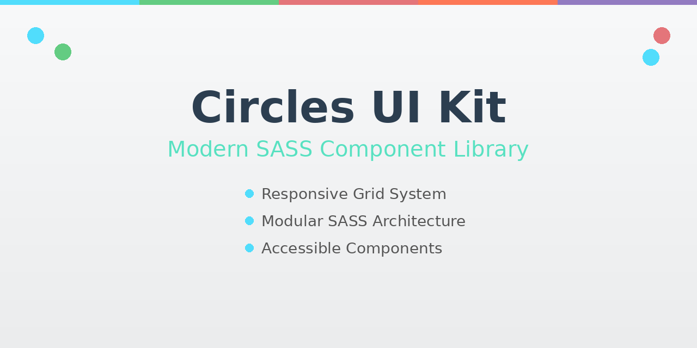

# Circles UI Kit

A modern, responsive UI component library built with SASS featuring modular design patterns, a flexible grid system, and clean CSS architecture.

**[View Live Demo →](https://projects.brianwalker.dev/sass-ui-kit-modular-design-system)**



## Features

- 🎨 **Five Button Variants** - Default, success, error, warning, and info styles
- 📝 **Accessible Form Components** - Styled inputs with ARIA labels and focus states
- 📐 **12-Column Responsive Grid** - Flexible, mobile-first layout system
- 🖼️ **Image Components** - Avatar circles and framed image styles
- 📱 **Mobile-First Design** - Fully responsive across all devices
- ⚡ **Optimized Build** - Compressed CSS output for production
- 🏗️ **Modern SASS** - Uses @use/@forward modules instead of deprecated @import

## Tech Stack

- **HTML5** - Semantic markup with accessibility features
- **SASS/SCSS** - Modular CSS preprocessing with variables and mixins
- **CSS3** - Modern styling with smooth transitions
- **Node.js & npm** - Build tooling and dependency management

## Installation & Usage

```bash
# Clone the repository
git clone https://github.com/brianwalkerdev/sass-ui-kit-modular-design-system.git
cd sass-ui-kit-modular-design-system

# Install dependencies
npm install

# Build CSS from SASS (production)
npm run build

# Watch mode for development (auto-compile on changes)
npm run watch
```

Open `index.html` in your browser to view the style guide.

## Deployment

This is a static site ready for deployment to any hosting platform:

### GitHub Pages
Push to your repository and enable GitHub Pages in settings. Point to the root directory.
```
https://yourusername.github.io/sass-ui-kit-modular-design-system
```

### Netlify
1. Connect your GitHub repository
2. Build command: `npm run build`
3. Publish directory: `.` (root)

### Vercel
1. Import your GitHub repository
2. Build command: `npm run build`
3. Output directory: `.` (root)

All files (`index.html`, `css/`, `images/`) are static and ready to deploy.

## Contact

**Brian Walker**  
📧 contact@brianwalker.dev  
🌐 [brianwalker.dev](https://brianwalker.dev)  
💼 [GitHub](https://github.com/brianwalkerdev)

---

Built with SASS | MIT License
